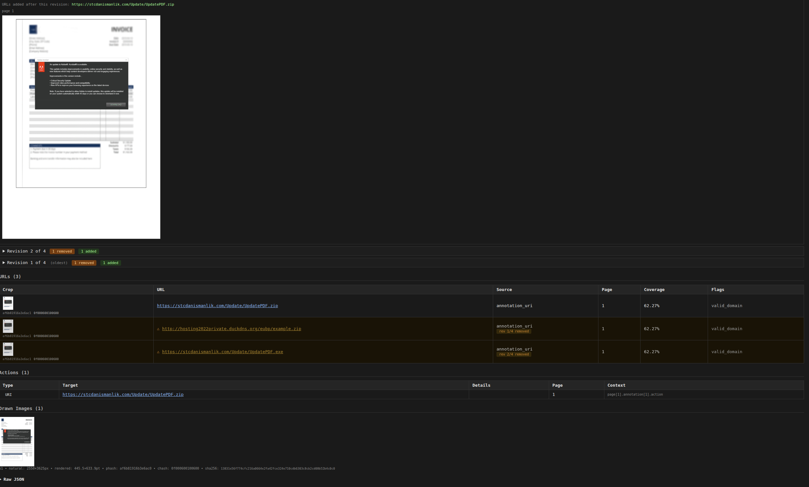
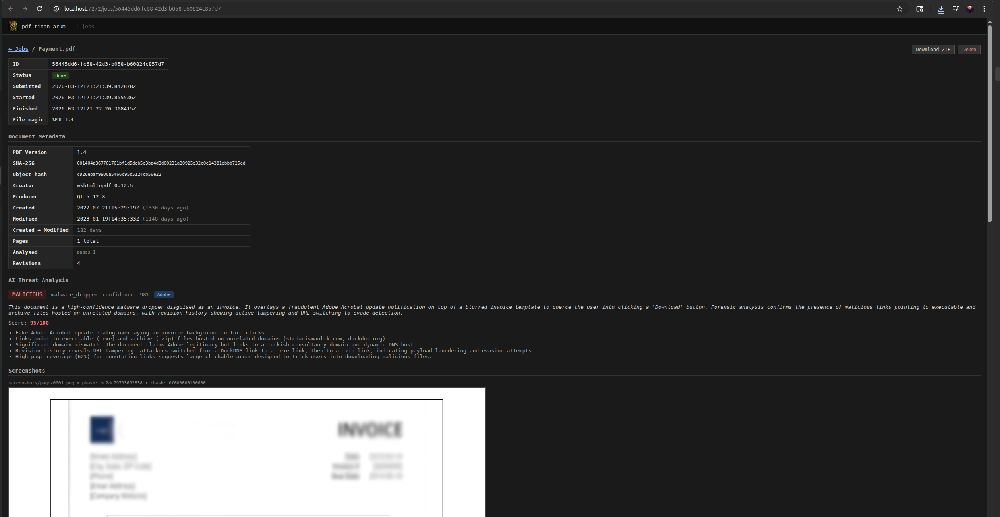
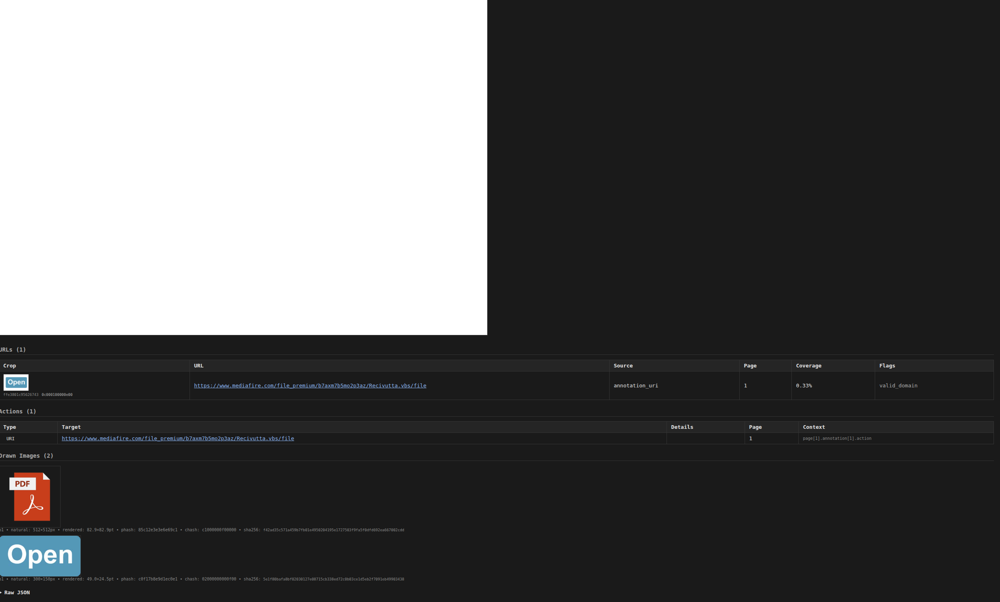

<p align="center">
  
</p>

<h1 align="center">pdf-titan-arum</h1>

<p align="center">
  <strong>PDF security triage and forensic analysis tool.</strong><br>
  Extracts indicators of compromise, embedded content, and structural metadata from PDF files into a structured <code>report.json</code> manifest.
</p>

<p align="center">
  🎵 <a href="https://suno.com/s/1ICR65q7HIpjFrLV">Theme song</a>
</p>

<p align="center">
  
  <br><br>
  
  <br><br>
  
</p>

---

## Metadata

| Field                       | Value                                 |
|-----------------------------|---------------------------------------|
| **Name**                    | pdf-titan-arum                         |
| **Version**                 | 1.3.0                                 |
| **Group**                   | com.oai                               |
| **Creator**                 | node5                                   |
| **Generator**               | Claude Sonnet 4.6 (claude-sonnet-4-6) |
| **Date Created**            | 2026-03-02                            |
| **Last Modified**           | 2026-03-12                            |
| **Days Since Creation**     | 10                                    |
| **Days Since Last Modified**| 0                                     |
| **License**                 | Apache 2.0                               |

---

## Requirements

- Java 17+
- Maven 3.9+
- For server mode: PostgreSQL 14+, Docker (optional)

---

## Build

```bash
# CLI fat JAR → target/pdf-titan-arum-1.3.0.jar
mvn package

# Server fat JAR → target/pdf-titan-arum-server-1.3.0.jar
mvn package -Pserver
```

---

## Quick Start

```bash
# Build
mvn package

# Analyse a PDF
java -jar target/pdf-titan-arum-1.3.0.jar --input suspicious.pdf --output ./out

# Results
cat out/report.json
```

---

## CLI Usage

```bash
java -jar target/pdf-titan-arum-1.3.0.jar \
  --input <pdf>                   # required
  --output <dir>                  # required
  [--dpi 150]                     # render DPI for screenshots
  [--pages "default"]             # page selection (see below)
  [--password <pwd>]              # password for encrypted PDFs
  [--add-link-annotations]        # add clickable annotations for bare visible URLs
  [--save-modified-pdf <path>]    # save annotated PDF to path (requires --add-link-annotations)
  [--skip-qr]                     # skip QR code detection
  [--skip-screenshots]            # skip screenshot rendering, URL crops, QR scan
  [--skip-images]                 # skip drawn and resource image extraction
  [--skip-phones]                 # skip phone number extraction
  [--skip-page-export]            # skip per-page PDF export
  [--skip-text-urls]              # skip PDFTextStripper; only annotation URLs extracted (~370ms faster)
  [--no-skip-blanks]              # disable blank-page replacement; process original selection including blanks
  [--timeout <seconds>]           # hard per-job time limit (0 = no limit); partial results written on timeout
  [--ocr-screenshots]             # run Tesseract OCR on each screenshot
  [--ocr-url-crops]               # run Tesseract OCR on each URL bounding-box crop
  [--ocr-lang eng]                # Tesseract language(s), e.g. eng+deu+fra (default: eng)
  [--ai-url <base-url>]           # OpenAI-compatible API base URL for AI threat analysis
  [--ai-key <key>]                # API key (omit or use 'none' for local/unauthenticated models)
  [--ai-model <model>]            # Model name (auto-detected from /models if not set)
  [--profile]                     # print per-stage wall-clock timing to stderr
```

### AI threat analysis examples

```bash
# Local vLLM / llama.cpp server (model auto-detected)
java -jar target/pdf-titan-arum-1.3.0.jar \
  --input suspicious.pdf --output ./out \
  --ai-url http://localhost:8001/v1

# OpenAI API
java -jar target/pdf-titan-arum-1.3.0.jar \
  --input suspicious.pdf --output ./out \
  --ai-url https://api.openai.com/v1 \
  --ai-key sk-... \
  --ai-model gpt-5-nano

# Fast URL-only scan + AI (no screenshots, no images)
java -jar target/pdf-titan-arum-1.3.0.jar \
  --input suspicious.pdf --output ./out \
  --skip-screenshots --skip-images --skip-phones --skip-page-export \
  --ai-url http://localhost:8001/v1

# With OCR — gives the model visible text from rendered pages
java -jar target/pdf-titan-arum-1.3.0.jar \
  --input suspicious.pdf --output ./out \
  --ocr-screenshots --ocr-url-crops \
  --ai-url http://localhost:8001/v1
```

The AI result is embedded in `report.json` under `aiAnalysis`:

```json
{
  "threatLevel": "likely_phishing",
  "confidence": 0.95,
  "classification": "credential_phishing",
  "brands": ["Microsoft"],
  "score": 90,
  "indicators": ["Full-page clickable link covering 94% of page area", "..."],
  "passwords": [],
  "translatedText": null,
  "summary": "..."
}
```

**Speed presets:**

| Goal | Flags |
|------|-------|
| Annotation URLs only (fastest) | `--skip-text-urls --skip-screenshots --skip-images --skip-phones --skip-page-export --skip-qr` |
| URL extraction only | `--skip-screenshots --skip-images --skip-phones --skip-page-export --skip-qr` |
| Full except QR | `--skip-qr` |

**Typical timing** (median, PDFs under 10 MB):

| Mode | Median |
|------|--------|
| Annotations only | 0.75s |
| URL-only (with text) | 1.02s |
| Full (no QR) | 1.74s |
| Full (with QR) | 1.91s |

### `--pages` syntax

| Spec      | Meaning                       |
|-----------|-------------------------------|
| `default` | First 4 pages + last page     |
| `1-5`     | Pages 1 through 5             |
| `1,3,5`   | Specific pages                |
| `even`    | Even-numbered pages           |
| `odd`     | Odd-numbered pages            |
| `^3`      | All pages except page 3       |
| `z`       | Last page                     |
| `1-zr`    | All pages in reverse          |

---

## Server Mode

### Run with Docker Compose

```bash
docker compose up
```

Server listens on `http://localhost:7272`.

### Run manually

```bash
java -jar target/pdf-titan-arum-server-1.3.0.jar server \
  --host 0.0.0.0 \
  --port 7272 \
  --db jdbc:postgresql://localhost/titanarum \
  --db-user titanarum \
  --db-password titanarum \
  --artifact-root /data/artifacts \
  [--workers 4] \
  [--timeout 60] \
  [--ocr-lang eng]
```

### Environment variables (Docker)

| Variable           | Default | Description                                                   |
|--------------------|---------|---------------------------------------------------------------|
| `DB_URL`           | —       | JDBC URL for PostgreSQL (required)                            |
| `DB_USER`          | —       | Database username (required)                                  |
| `DB_PASSWORD`      | —       | Database password (required)                                  |
| `PORT`             | 7272    | Listen port                                                   |
| `WORKERS`          | CPUs−1  | Worker thread count                                           |
| `TIMEOUT`          | 60      | Per-job timeout in seconds (0 = no limit)                     |
| `OCR_LANG`         | eng     | Tesseract language(s), e.g. `eng+deu+fra`                     |
| `OPENAI_BASE_URL`  | —       | OpenAI-compatible API base URL; enables AI analysis when set  |
| `OPENAI_API_KEY`   | —       | API key (use `none` for local unauthenticated models)         |
| `OPENAI_MODEL`     | —       | Model name (auto-detected from `/models` if not set)          |

### AI analysis (server)

AI threat analysis is **opt-in** — it is disabled by default and only runs when `OPENAI_BASE_URL` is set. The model is auto-detected from the `/models` endpoint if `OPENAI_MODEL` is not specified.

**Option 1 — Local model (vLLM, llama.cpp, Ollama, etc.) running on the host:**

```yaml
# docker-compose.yml
environment:
  OPENAI_BASE_URL: http://host.docker.internal:8001/v1
  OPENAI_API_KEY: none          # no auth required for local models
  # OPENAI_MODEL: qwen2.5-7b   # explicit model name (optional; auto-detected if blank)
extra_hosts:
  - "host.docker.internal:host-gateway"   # Linux only — lets the container reach the host
```

`host.docker.internal` resolves to the host machine's gateway IP. On Linux you need the `extra_hosts` entry; on Docker Desktop (Mac/Windows) it works automatically.

**Option 2 — OpenAI API:**

```yaml
environment:
  OPENAI_BASE_URL: https://api.openai.com/v1
  OPENAI_API_KEY: sk-...
  OPENAI_MODEL: gpt-5-nano          # optional; auto-detected if blank
```

**Option 3 — Any OpenAI-compatible endpoint** (Azure OpenAI, Anthropic via proxy, etc.): set `OPENAI_BASE_URL` to the endpoint base and `OPENAI_API_KEY` to the appropriate key.

Each job's `report.json` (and the web UI) will include an `aiAnalysis` block:

```json
{
  "threatLevel": "likely_phishing",
  "confidence": 0.95,
  "classification": "credential_phishing",
  "brands": ["Adobe"],
  "score": 90,
  "indicators": ["Full-page clickable link covering 94% of page", "wkhtmltopdf producer common in phishing"],
  "passwords": [],
  "translatedText": null,
  "summary": "This PDF impersonates Adobe Acrobat DC..."
}
```

---

## REST API

| Method   | Path                              | Description                                                   |
|----------|-----------------------------------|---------------------------------------------------------------|
| `POST`   | `/api/jobs`                       | Submit a PDF (`multipart/form-data`, field `file`). Boolean fields: `skipScreenshots`, `skipImages`, `skipPhones`, `skipPageExport`, `skipTextUrls`, `skipQr`, `ocrScreenshots`, `ocrUrlCrops`, `addLinkAnnotations`, `noSkipBlanks`. String fields: `password` (encrypted PDFs; cleared from DB after worker reads it), `pagesSpec` (e.g. `1-4,z` or `all`; default: server default), `ocrLang` (e.g. `eng+deu`; default: server `OCR_LANG`). Numeric fields: `dpi` (50–600; default: 150), `timeoutSeconds` (5–3600; default: server `TIMEOUT`). Returns `{id, status, filename}`. |
| `GET`    | `/api/jobs`                       | List jobs. Query params: `page`, `size`, `status`.            |
| `GET`    | `/api/jobs/{id}`                  | Job detail including full `report` JSON.                      |
| `DELETE` | `/api/jobs/{id}`                  | Delete job and all artifacts.                                 |
| `GET`    | `/api/jobs/{id}/download`         | Download all artifacts as ZIP.                                |
| `GET`    | `/api/jobs/{id}/artifacts/{path}` | Serve individual artifact file.                               |
| `GET`    | `/api/jobs/{id}/status`           | SSE stream of live job status updates.                        |

---

## Extraction Features

### Document Metadata
- PDF version from file header (e.g. `1.7`, `2.0`)
- SHA-256 of raw PDF bytes
- PDF object hash — structural fingerprint (MD5 of pipe-joined xref type sequence); compatible with the Proofpoint/EmergingThreats algorithm for campaign clustering
- Standard `PDDocumentInformation` fields: title, author, subject, keywords, creator, producer
- Creation and modification dates with days-ago values and days-between-created-and-modified
- Revision count (number of incremental saves detected via `%%EOF` scanning)

### Blank Page Detection
- Classifies each page as blank or content-bearing before extraction
- Three-tier check: structural (no `/Contents`), annotation presence (annotated pages are never blank — preserves invisible link trap detection), then content-stream operator walk with short-circuit on first paint op
- Blank pages in the selected page set are **replaced** with the next available non-blank pages in document order (e.g. if pages 2–4 are blank, they are filled with pages 5–6 etc.)
- `blankPageCount`, `blankPages[]`, and `blankRatio` (0.0–1.0) reported in `report.json`
- High `blankRatio` (≥ 0.5) is a strong phishing/malware signal — padding pages are common in document-lure campaigns
- Use `--no-skip-blanks` to disable replacement and process the original page selection as-is

### URLs
- Extracts from existing `PDAnnotationLink` annotation objects
- Regex detection of bare visible URLs in rendered text (`PositionAwareTextStripper`)
- Handles `hxxp`/`hxxps` obfuscation, normalised to `http://`/`https://`
- Deduplication by (page, url, bounding box)
- Bounding-box crop PNG thumbnails with phash + SHA-256
- Domain classification flags: `valid_domain`, `unknown_tld`, `private_ip`, `localhost`, `suspicious_tld`
- Page coverage ratio (full-page invisible overlays detected)
- Revision history: which incremental save introduced each URL

### Screenshots
- Per-page PNG renders at configurable DPI (default 150), then standardized to 1200 px wide (typical laptop Adobe Reader viewport)
- phash (64-bit DCT perceptual hash) + SHA-256
- URL bounding-box crops and extracted images retain their natural dimensions (not standardized)

### Images
Two extraction strategies run per page selection:

| Strategy        | Source                       | `source` value                                |
|-----------------|------------------------------|-----------------------------------------------|
| Drawn images    | Content stream renderer      | `drawn_xobject` / `drawn_inline_image`        |
| Resource images | Page XObject resource dict   | `resource_xobject`                            |

- JPEG and JPEG2000 XObjects saved in **original encoded format** (`originalPath`) alongside a rendered PNG (`path`) for display
- SHA-256 computed on original encoded bytes when available (not re-encoded PNG)
- phash + optional QR scan on rendered PNG
- Bounding box recorded for drawn images

### JavaScript
Traverses all PDF action attachment points:
- Document open action (`/OpenAction`)
- Additional actions (`/AA`) on catalog, pages, annotations, and form fields
- Name-tree scripts (`/JavaScript` name tree)
- Chained `Next` actions (cycle-safe with visited set)

Each hit saved as a `.js.txt` artifact with SHA-256.

### XFA
- Parses embedded XFA XML (`/XFA` stream or array of streams)
- Extracts `<script>` blocks with their `contentType` (JavaScript, FormCalc, etc.)
- Each script saved as artifact with SHA-256

### Embedded Files
- Name-tree embedded files (`/EmbeddedFiles`)
- File attachment annotations (`/Filespec`)
- All file types saved regardless of MIME type (up to configurable size limit)
- SHA-256 on raw file bytes, MIME type detection via declared subtype or `Files.probeContentType`

### Launch Actions
- `/Launch` actions (Win32 `app`/`params`/`dir`, Unix, Mac subtypes)
- Extracts file path, parameters, working directory, `newWindow` flag
- Text summary artifact saved with SHA-256

### Normalized Actions
Four additional action types in a unified `actions[]` model:

| Type         | Key fields                                        |
|--------------|---------------------------------------------------|
| `SubmitForm` | `submitUrl`, `fields[]`, `submitFlags`            |
| `ImportData` | `importFile`                                      |
| `GoToR`      | `remoteFile`, `destination`, `newWindow`          |
| `GoToE`      | `remoteFile`, `embeddedTarget`, `newWindow`       |

`SubmitForm` target URLs and `GoToR`/`GoToE` remote file paths are also fed into the URL list.

### QR Codes
- ZXing detection on rendered screenshots and extracted images
- Per hit: decoded text, format, bounding box coordinates

### Phone Numbers
- libphonenumber extraction from visible page text and JavaScript content
- E.164 normalisation, country code, geocode

### Page PDFs
- Selected pages exported as individual single-page PDFs
- SHA-256 per exported page

### Perceptual Hashing
Two complementary hashes computed for every image artifact (screenshots, drawn images, resource images, URL crops):

| Hash | Algorithm | Bits | Hex chars | Captures |
|------|-----------|------|-----------|---------|
| `phash` | DCT-based: Lanczos resize → 32×32 grayscale → 2D DCT-II → 8×8 low-frequency block → median threshold | 64 | 16 | Structure / edges / layout |
| `colorhash` | HSV histogram: 1 black bin + 1 gray bin + 6 faint-color hue bins + 6 bright-color hue bins, each encoded as 4 bits | 56 | 14 | Color palette / saturation distribution |

Both are bit-level compatible with Python [`imagehash`](https://github.com/JohannesBuchner/imagehash) (`phash()` and `colorhash(binbits=4)`). SHA-256 is also computed on the saved file bytes.

The two hashes are complementary signals: a phishing kit may reuse the same color palette across different document layouts (phash differs, colorhash matches), or the same layout with swapped brand colors (phash matches, colorhash differs).

---

## Output Structure

```
<output-dir>/
  report.json                              # Full manifest
  screenshots/
    page-0001.png
  url_crops/
    url-crop-0001.png                      # Bounding-box crop per URL
  images_rendered/
    drawn-page-0001-image-0001.png         # Rendered PNG (display)
    drawn-page-0001-image-0001-original.jpg  # Original JPEG when available
  images_resources/
    resource-page-0001-Im0.png
    resource-page-0001-Im0-original.jpg
  pages/
    page-0001.pdf                          # Single-page PDF exports
  attachments/
    <filename>                             # Embedded file attachments
  scripts/
    <context>.js.txt                       # JavaScript artifacts
  xfa/
    xfa-script-0.txt
  launch_actions/
    <context>.launch.txt
```

### `report.json` top-level fields

| Field             | Type   | Description                                          |
|-------------------|--------|------------------------------------------------------|
| `generatedAt`     | string | ISO-8601 generation timestamp                        |
| `sourceFile`      | string | Input filename                                       |
| `documentSha256`  | string | SHA-256 of raw PDF bytes                             |
| `pdfObjectHash`   | string | Structural fingerprint: MD5 of pipe-joined xref object type sequence (Proofpoint/EmergingThreats algorithm) |
| `fileMagic`       | string | First 16 bytes of the file as hex (useful for detecting PDF-wrapped formats) |
| `dpi`             | number | Render DPI used                                      |
| `documentInfo`    | object | PDF metadata: `pdfVersion`, `title`, `author`, `subject`, `keywords`, `creator`, `producer`, `creationDate`, `modificationDate`, date deltas |
| `pageCount`       | number | Total pages in document                              |
| `pagesProcessed`  | array  | 1-based page numbers that were analysed              |
| `blankPageCount`  | number | Number of blank/empty pages detected                 |
| `blankPages`      | array  | 1-based page numbers of blank pages (omitted if none) |
| `blankRatio`      | number | `blankPageCount / pageCount` (omitted if zero)       |
| `revisionCount`   | number | Number of incremental saves detected                 |
| `revisions`       | array  | Per-revision URL diff: added/removed URLs, screenshots, visual-change flag |
| `fonts`           | array  | Font names used across processed pages               |
| `urls`            | array  | `UrlHit[]`                                           |
| `javascript`      | array  | `JavaScriptHit[]`                                    |
| `xfaScripts`      | array  | `XfaScriptHit[]`                                     |
| `launchActions`   | array  | `LaunchActionHit[]`                                  |
| `actions`         | array  | `ActionHit[]` (SubmitForm / ImportData / GoToR / GoToE) |
| `embeddedFiles`   | array  | `EmbeddedFileHit[]`                                  |
| `emails`          | array  | Email addresses extracted from page text and JavaScript |
| `phoneNumbers`    | array  | `PhoneHit[]`                                         |
| `screenshots`     | array  | `ScreenshotArtifact[]`                               |
| `renderedImages`  | array  | `ImageArtifact[]` (drawn and inline images)          |
| `resourceImages`  | array  | `ImageArtifact[]` (XObject resource images)          |
| `pagePdfs`        | array  | `PagePdfArtifact[]`                                  |
| `pageTexts`       | array  | Per-page extracted text (first N processed pages)    |
| `ocgLayers`       | array  | `OcgLayer[]` — optional content groups / hidden layers |
| `parseError`      | string | Set if the PDF could not be fully parsed (e.g. wrong password, corrupt structure) |
| `timedOut`        | bool   | `true` if job hit the timeout limit (partial results) |
| `timedOutAfterMs` | number | Elapsed ms when timeout triggered                    |
| `aiAnalysis`      | object | AI threat assessment (see below); `null` if disabled |

---

## Key Dependencies

| Library              | Version  | Purpose                                  |
|----------------------|----------|------------------------------------------|
| Apache PDFBox        | 3.0.6    | PDF parsing and rendering                |
| ZXing                | 3.5.4    | QR / barcode detection                   |
| libphonenumber       | 9.0.25   | Phone number extraction and normalisation |
| Guava                | 33.5.0   | Public suffix list for domain checks     |
| Jackson              | 2.19.0   | JSON serialisation                       |
| picocli              | 4.7.7    | CLI argument parsing                     |
| jai-imageio-jpeg2000 | 1.4.0    | JPEG2000 image decoding                  |
| jbig2-imageio        | 3.0.4    | JBIG2 image decoding                     |
| Javalin              | 6.7.0    | HTTP server (server mode)                |
| Pebble               | 3.2.4    | HTML templates (server mode)             |
| HikariCP             | 5.1.0    | Connection pool (server mode)            |
| Flyway               | 10.15.0  | DB schema migrations (server mode)       |
| PostgreSQL JDBC      | 42.7.3   | Database driver (server mode)            |
| zip4j                | 2.11.5   | AES-256 encrypted ZIP downloads (server mode) |
