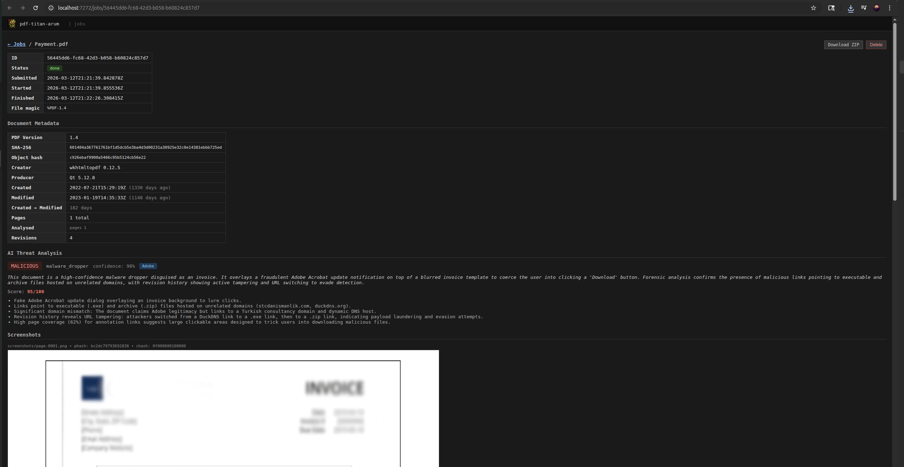
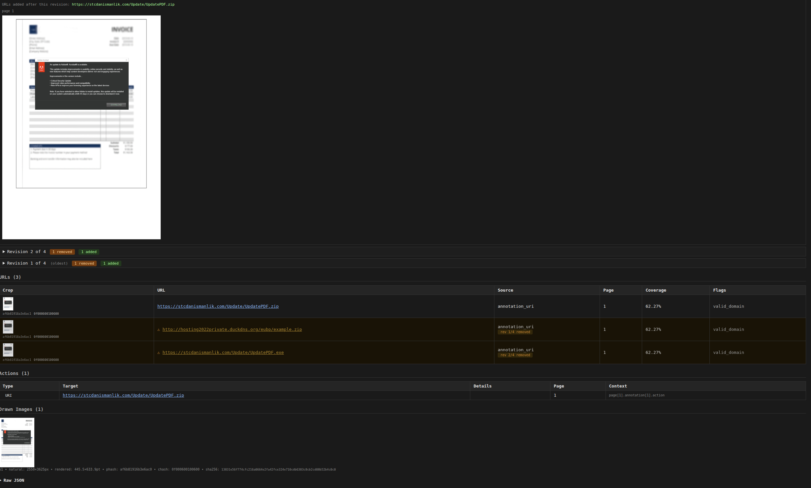
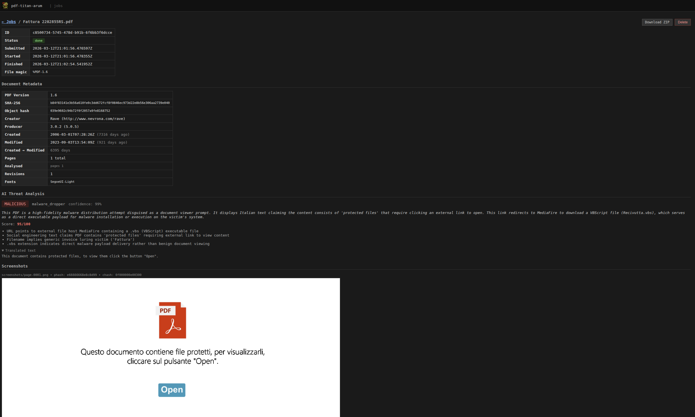
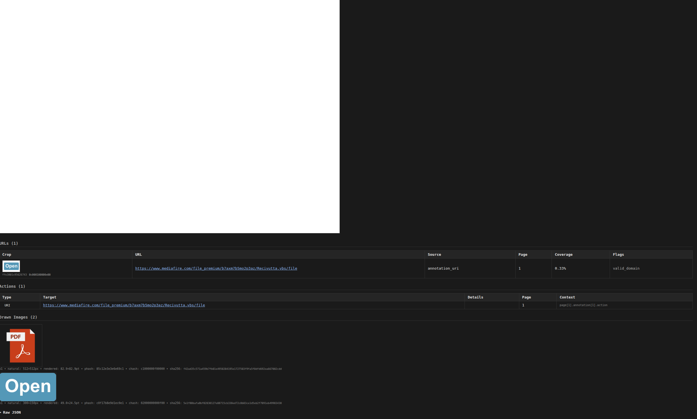

<p align="center">
  
</p>

<h1 align="center">pdf-titan-arum</h1>

<p align="center">
  <strong>PDF security triage and forensic analysis tool.</strong><br>
  Extracts indicators of compromise, embedded content, and structural metadata from PDF files into a structured <code>report.json</code> manifest.
</p>

<p align="center">
  <a href="https://suno.com/s/1ICR65q7HIpjFrLV"><strong>🎵 &nbsp; Listen to the theme song &nbsp; 🎵</strong></a>
</p>

<p align="center">
  
  <br><br>
  
  <br><br>
  
  <br><br>
  
</p>

---

## Requirements

- Java 17+
- Maven 3.9+
- For server mode: PostgreSQL 14+, Docker (optional)
- For QR/barcode scanning: the zxing-cpp `ZXingReader` binary on `PATH` (or set `TITANARUM_ZXING_BIN` to its path). Any release works — titanarum auto-detects `-json` (≥ 2.3) and falls back to the 2.2.x plaintext format. Optional — if the binary is absent, titanarum prints a one-time warning and skips QR scanning; all other analysis is unaffected. Pass `--skip-qr` to opt out entirely. (The Docker images below bundle it, so QR works there out of the box.)

---

## Build

```bash
# CLI fat JAR → target/pdf-titan-arum-1.3.0.jar
mvn package

# Server fat JAR → target/pdf-titan-arum-server-1.3.0.jar
mvn package -Pserver
```

---

## Quick Start

```bash
# Build
mvn package

# Analyse a PDF
java -jar target/pdf-titan-arum-1.3.0.jar --input suspicious.pdf --output ./out

# Results
cat out/report.json
```

### Run standalone in Docker

titanarum runs two ways: **standalone** (the self-contained analysis jar — everything below) and as a **[blastbox engine](#blastbox-fleet-engine)** (the fleet/worker deployment under `deploy/`). They are independent; the jar has no blastbox dependency. To run the standalone CLI in a container — the jar, the `ZXingReader` QR binary, and render fonts are all bundled, so QR works with no extra setup:

```bash
# Base image (jar + ZXingReader + fonts), then a thin CLI image on top:
docker build -f deploy/docker/Dockerfile.titanarum-base -t pdf-titan-arum-base:dev .
docker build -f deploy/docker/Dockerfile.titanarum-cli \
  --build-arg BASE_IMAGE=pdf-titan-arum-base:dev -t titanarum-cli:dev .

# Analyse a PDF (bind-mount a work dir for input + output):
# (add --user "$(id -u):$(id -g)" if you want the output files owned by you rather than root)
docker run --rm -v "$PWD":/work titanarum-cli:dev \
  --input /work/suspicious.pdf --output /work/out
```

---

## CLI Usage

```bash
java -jar target/pdf-titan-arum-1.3.0.jar \
  --input <pdf>                   # required
  --output <dir>                  # required
  [--dpi 150]                     # render DPI for screenshots
  [--pages "default"]             # page selection (see below)
  [--password <pwd>]              # password for encrypted PDFs
  [--add-link-annotations]        # add clickable annotations for bare visible URLs
  [--save-modified-pdf <path>]    # save annotated PDF to path (requires --add-link-annotations)
  [--skip-qr]                     # skip QR code detection
  [--skip-screenshots]            # skip screenshot rendering, URL crops, QR scan
  [--skip-images]                 # skip drawn and resource image extraction
  [--skip-phones]                 # skip phone number extraction
  [--skip-page-export]            # skip per-page PDF export
  [--skip-text-urls]              # skip PDFTextStripper; only annotation URLs extracted (~370ms faster)
  [--no-skip-blanks]              # disable blank-page replacement; process original selection including blanks
  [--timeout <seconds>]           # hard per-job time limit (0 = no limit); partial results written on timeout
  [--ocr-screenshots]             # run Tesseract OCR on each screenshot
  [--ocr-url-crops]               # run Tesseract OCR on each URL bounding-box crop
  [--ocr-lang eng]                # Tesseract language(s), e.g. eng+deu+fra (default: eng)
  [--ai-url <base-url>]           # OpenAI-compatible API base URL for AI threat analysis
  [--ai-key <key>]                # API key (omit or use 'none' for local/unauthenticated models)
  [--ai-model <model>]            # Model name (auto-detected from /models if not set)
  [--profile]                     # print per-stage wall-clock timing to stderr
```

### AI threat analysis examples

```bash
# Local vLLM / llama.cpp server (model auto-detected)
java -jar target/pdf-titan-arum-1.3.0.jar \
  --input suspicious.pdf --output ./out \
  --ai-url http://localhost:8001/v1

# OpenAI API
java -jar target/pdf-titan-arum-1.3.0.jar \
  --input suspicious.pdf --output ./out \
  --ai-url https://api.openai.com/v1 \
  --ai-key sk-... \
  --ai-model gpt-5-nano

# Fast URL-only scan + AI (no screenshots, no images)
java -jar target/pdf-titan-arum-1.3.0.jar \
  --input suspicious.pdf --output ./out \
  --skip-screenshots --skip-images --skip-phones --skip-page-export \
  --ai-url http://localhost:8001/v1

# With OCR — gives the model visible text from rendered pages
java -jar target/pdf-titan-arum-1.3.0.jar \
  --input suspicious.pdf --output ./out \
  --ocr-screenshots --ocr-url-crops \
  --ai-url http://localhost:8001/v1
```

The AI result is embedded in `report.json` under `aiAnalysis`:

```json
{
  "threatLevel": "likely_phishing",
  "confidence": 0.95,
  "classification": "credential_phishing",
  "brands": ["Microsoft"],
  "score": 90,
  "indicators": ["Full-page clickable link covering 94% of page area", "..."],
  "passwords": [],
  "translatedText": null,
  "summary": "..."
}
```

**Speed presets:**

| Goal | Flags |
|------|-------|
| Annotation URLs only (fastest) | `--skip-text-urls --skip-screenshots --skip-images --skip-phones --skip-page-export --skip-qr` |
| URL extraction only | `--skip-screenshots --skip-images --skip-phones --skip-page-export --skip-qr` |
| Full except QR | `--skip-qr` |

**Typical timing** (median, PDFs under 10 MB):

| Mode | Median |
|------|--------|
| Annotations only | 0.75s |
| URL-only (with text) | 1.02s |
| Full (no QR) | 1.74s |
| Full (with QR) | 1.91s |

### `--pages` syntax

| Spec      | Meaning                       |
|-----------|-------------------------------|
| `default` | First 4 pages + last page     |
| `1-5`     | Pages 1 through 5             |
| `1,3,5`   | Specific pages                |
| `even`    | Even-numbered pages           |
| `odd`     | Odd-numbered pages            |
| `^3`      | All pages except page 3       |
| `z`       | Last page                     |
| `1-zr`    | All pages in reverse          |

---

## Server Mode

### Run with Docker Compose

```bash
docker compose up
```

Server listens on `http://localhost:7272`.

### Run manually

```bash
java -jar target/pdf-titan-arum-server-1.3.0.jar server \
  --host 0.0.0.0 \
  --port 7272 \
  --db jdbc:postgresql://localhost/titanarum \
  --db-user titanarum \
  --db-password titanarum \
  --artifact-root /data/artifacts \
  [--workers 4] \
  [--timeout 60] \
  [--ocr-lang eng]
```

### Environment variables (Docker)

| Variable           | Default | Description                                                   |
|--------------------|---------|---------------------------------------------------------------|
| `DB_URL`           | —       | JDBC URL for PostgreSQL (required)                            |
| `DB_USER`          | —       | Database username (required)                                  |
| `DB_PASSWORD`      | —       | Database password (required)                                  |
| `PORT`             | 7272    | Listen port                                                   |
| `WORKERS`          | CPUs−1  | Worker thread count                                           |
| `TIMEOUT`          | 60      | Per-job timeout in seconds (0 = no limit)                     |
| `OCR_LANG`         | eng     | Tesseract language(s), e.g. `eng+deu+fra`                     |
| `OPENAI_BASE_URL`  | —       | OpenAI-compatible API base URL; enables AI analysis when set  |
| `OPENAI_API_KEY`   | —       | API key (use `none` for local unauthenticated models)         |
| `OPENAI_MODEL`     | —       | Model name (auto-detected from `/models` if not set)          |

### AI analysis (server)

AI threat analysis is **opt-in** — it is disabled by default and only runs when `OPENAI_BASE_URL` is set. The model is auto-detected from the `/models` endpoint if `OPENAI_MODEL` is not specified.

**Option 1 — Local model (vLLM, llama.cpp, Ollama, etc.) running on the host:**

```yaml
# docker-compose.yml
environment:
  OPENAI_BASE_URL: http://host.docker.internal:8001/v1
  OPENAI_API_KEY: none          # no auth required for local models
  # OPENAI_MODEL: qwen2.5-7b   # explicit model name (optional; auto-detected if blank)
extra_hosts:
  - "host.docker.internal:host-gateway"   # Linux only — lets the container reach the host
```

`host.docker.internal` resolves to the host machine's gateway IP. On Linux you need the `extra_hosts` entry; on Docker Desktop (Mac/Windows) it works automatically.

**Option 2 — OpenAI API:**

```yaml
environment:
  OPENAI_BASE_URL: https://api.openai.com/v1
  OPENAI_API_KEY: sk-...
  OPENAI_MODEL: gpt-5-nano          # optional; auto-detected if blank
```

**Option 3 — Any OpenAI-compatible endpoint** (Azure OpenAI, Anthropic via proxy, etc.): set `OPENAI_BASE_URL` to the endpoint base and `OPENAI_API_KEY` to the appropriate key.

Each job's `report.json` (and the web UI) will include an `aiAnalysis` block:

```json
{
  "threatLevel": "likely_phishing",
  "confidence": 0.95,
  "classification": "credential_phishing",
  "brands": ["Adobe"],
  "score": 90,
  "indicators": ["Full-page clickable link covering 94% of page", "wkhtmltopdf producer common in phishing"],
  "passwords": [],
  "translatedText": null,
  "summary": "This PDF impersonates Adobe Acrobat DC..."
}
```

---

## REST API

| Method   | Path                              | Description                                                   |
|----------|-----------------------------------|---------------------------------------------------------------|
| `POST`   | `/api/jobs`                       | Submit a PDF (`multipart/form-data`, field `file`). Boolean fields: `skipScreenshots`, `skipImages`, `skipPhones`, `skipPageExport`, `skipTextUrls`, `skipQr`, `ocrScreenshots`, `ocrUrlCrops`, `addLinkAnnotations`, `noSkipBlanks`. String fields: `password` (encrypted PDFs; cleared from DB after worker reads it), `pagesSpec` (e.g. `1-4,z` or `all`; default: server default), `ocrLang` (e.g. `eng+deu`; default: server `OCR_LANG`). Numeric fields: `dpi` (50–600; default: 150), `timeoutSeconds` (5–3600; default: server `TIMEOUT`). Returns `{id, status, filename}`. |
| `GET`    | `/api/jobs`                       | List jobs. Query params: `page`, `size`, `status`.            |
| `GET`    | `/api/jobs/{id}`                  | Job detail including full `report` JSON.                      |
| `DELETE` | `/api/jobs/{id}`                  | Delete job and all artifacts.                                 |
| `GET`    | `/api/jobs/{id}/download`         | Download all artifacts as ZIP.                                |
| `GET`    | `/api/jobs/{id}/artifacts/{path}` | Serve individual artifact file.                               |
| `GET`    | `/api/jobs/{id}/status`           | SSE stream of live job status updates.                        |

---

## Blastbox fleet engine

Besides the standalone jar and the single-node [Server Mode](#server-mode), titanarum ships as a
**blastbox fleet engine** (`titanarum.engine:TitanArumEngine`) under `deploy/`. Ingress, dispatch,
the job store, and the worker pool are all blastbox.host's; titanarum only supplies the PDF engine
and the prebaked worker image. The two modes are independent — **the standalone jar has no blastbox
dependency**, and the engine adapter never runs the CLI's HTTP server.

The stack is a submit → queue → dispatch → sealed-result pipeline: an `api` (blastbox core routes)
writes each job to Postgres; a `dispatcher` claims queued jobs and launches **one hardened,
disposable cold-worker container per job** (runsc/gVisor by default) that runs the JVM in-process
over a file-IPC handshake; the sealed output (report + artifacts) is served back by id. Only the
dispatcher touches the Docker socket (via a locked-down `docker-socket-proxy`); the api never does.

> The compose stack is scoped by `COMPOSE_PROJECT_NAME=titanarum-bb`, so it coexists on one host
> with sibling blastbox engines (redtusk-bb, clippyshot) without collision — it reserves a unique
> port (8004) and a unique `TITANARUM_DATA_DIR`.

### Compose deployment (on-prem)

The cold tier (a disposable gVisor/runc worker per job) is the default:

```sh
# 1. Build the images (base → cold-worker, plus the api/dispatcher host image).
#    The cold-worker's BASE_IMAGE ARG defaults to :dev, so pass --build-arg to pin it to your TAG.
docker build -f deploy/docker/Dockerfile.titanarum-base        -t pdf-titan-arum-base:pha2 .
docker build -f deploy/docker/Dockerfile.titanarum-cold-worker \
             --build-arg BASE_IMAGE=pdf-titan-arum-base:pha2   -t titanarum-cold-worker:pha2 .
docker build -f deploy/docker/Dockerfile.titanarum-host        -t titanarum:pha2 .

# 2. Configure (POSTGRES_PASSWORD is required — no default; compose fails fast if unset)
cp deploy/docker/.env.example deploy/docker/.env
#   edit .env: POSTGRES_PASSWORD (openssl rand -base64 32), TAG, TITANARUM_DATA_DIR
# create the shared job root (UID 10001); source .env first so $TITANARUM_DATA_DIR is set in-shell:
set -a && . deploy/docker/.env && set +a
sudo mkdir -p "$TITANARUM_DATA_DIR" && sudo chown -R 10001:10001 "$TITANARUM_DATA_DIR"

# 3. Start (the wrapper auto-writes DOCKER_GID; everything else passes through to docker compose)
./deploy/docker/titanarum-compose up --build -d
# API at http://localhost:8004/  (submit / status / list / artifacts / result / similar)
```

**Warm-tier sidecars** cut per-job latency by reusing a pre-booted JVM. They are opt-in overlays
merged on top of the base stack:

- **Firecracker microVM** (guest-RAM snapshot; needs a KVM host, `/dev/kvm`):
  `./deploy/docker/titanarum-compose --firecracker up --build -d`
- **gVisor C/R** (checkpoint/restore a warmed JVM): there's no wrapper flag — merge the overlay with
  raw compose from `deploy/docker/`:
  `docker compose -f docker-compose.yml -f docker-compose.gvisor.yml up -d` (see the overlay header).

### AWS / cloud workers

titanarum is a blastbox **engine**, so the AWS worker tiers are selected and configured entirely
with `BLASTBOX_*` knobs on the dispatcher (they're blastbox.host's, engine-agnostic); titanarum only
supplies the prebaked ARM64 worker image. The framework offers four tiers — `aws-ec2` and
`aws-lambda-microvm` are **disposable** (one job, then terminate); `aws-ec2-hibernate` and
`aws-lambda-snapstart` are **warm** (hibernate / SnapStart C/R keeps the same warmed JVM across
jobs). `deploy/aws/Dockerfile.titanarum-http-agent` targets the disposable `aws-ec2` tier.

**Worker image (ARM64).** It bakes the fat jar + a from-source arm64 ZXingReader v3.1.0 + blastbox's
generic HTTP agent, which serves `GET /healthz` + `POST /detonate` and runs `engine.warmup()` before
it binds — so a healthy `/healthz` means warm:

```dockerfile
# key env the image sets (deploy/aws/Dockerfile.titanarum-http-agent):
ENV BLASTBOX_ENGINE=titanarum.engine:TitanArumEngine \
    TITANARUM_WORKER_JAR=/app/pdf-titan-arum.jar \
    TITANARUM_JAVA_LIBRARY_PATH=/app \
    TITANARUM_ZXING_BIN=/usr/local/bin/ZXingReader \
    BLASTBOX_WORKER_AGENT_PORT=8765
CMD ["python", "-m", "blastbox.worker.http_agent"]
```

Build it **natively on an arm64 host** (an aarch64 EC2 instance — no QEMU) or with
`docker buildx --platform linux/arm64`, then bake an AMI from it (or a MicroVM image for the Lambda
tiers). The host POSTs each job's PDF and gets the sealed output tar back over blastbox's generic
`remote_http` transport.

**Disposable EC2 — one job, then terminate** (`BLASTBOX_*` on the dispatcher):

```sh
BLASTBOX_POOL_RUNTIME=aws-ec2
BLASTBOX_AWS_REGION=us-east-1
BLASTBOX_EC2_AMI=ami-...                  # the titanarum worker AMI (agent brought up via user-data)
BLASTBOX_EC2_INSTANCE_TYPE=m7g.large      # ARM64
BLASTBOX_EC2_SUBNET_ID=subnet-...
BLASTBOX_EC2_SECURITY_GROUPS=sg-...
BLASTBOX_EC2_AGENT_TOKEN=<bearer>         # expected on the readiness probe + /detonate
BLASTBOX_EC2_SELF_TERMINATE=1             # guest self-kills after MAX_DURATION_S (no leaked instance)
BLASTBOX_POOL_WARMING_TIMEOUT_S=240       # first boot can exceed the 120s default
```

**Warm EC2 hibernate — `stop --hibernate`/`start` C/R; the same warmed JVM serves the pre-hibernate
and post-resume jobs** (reuses every `BLASTBOX_EC2_*` / `BLASTBOX_AWS_*` above):

```sh
BLASTBOX_POOL_RUNTIME=aws-ec2-hibernate
BLASTBOX_EC2_INSTANCE_TYPE=m7g.large      # hibernation-capable (t4g/m6g/m7g, RAM ≤ 150 GB)
BLASTBOX_EC2_AMI=ami-...                  # a hibernation-enabled build of the worker AMI
BLASTBOX_EC2_ROOT_VOLUME_GB=30            # ≥ instance RAM (RAM is saved to the encrypted root EBS)
BLASTBOX_EC2_ORPHAN_MAX_AGE_S=3600        # host-side sweep for slots parked when a dispatcher crashed
```

> The shipped `deploy/aws/Dockerfile.titanarum-http-agent` is MVP-scoped to the **disposable**
> `aws-ec2` tier (no AOT cache). The warm tiers above reuse the same `BLASTBOX_*` knobs, but want a
> warm-capable image build (bake an AOT cache, and a hibernation-enabled AMI for `aws-ec2-hibernate`).

Both AWS families are **fail-closed**: a tier is refused at selection unless `sts get-caller-identity`
and a read-only service probe both pass. Instance IP is **private by default**; a public IP
(`BLASTBOX_EC2_PUBLIC_IP=1`) requires dispatcher mTLS (`blastbox pki init` → `BLASTBOX_DISPATCH_TLS_*`
plus the agent's `BLASTBOX_WORKER_AGENT_CLIENT_CA`) or the runtime fails closed. For local + cloud
overflow, use `BLASTBOX_POOL_RUNTIME=cascade` with e.g. `BLASTBOX_POOL_TIERS=static:8,aws-ec2:16`.
See blastbox.host's `CONFIGURATION.md` / `DEPLOYMENT.md` for the full per-tier knob reference.

### Per-job parameters

The web UI / API forwards allowlisted **uppercase** `TITANARUM_*` params to the worker (lowercase
keys are dropped before the allowlist). They map onto the same knobs as the CLI / REST fields:

| Env | Meaning | Default |
|---|---|---|
| `TITANARUM_DPI` | render DPI (clamped to 1–600) | 150 |
| `TITANARUM_PAGES` | page spec (`1-4,z`, `all`) | first 4 + last |
| `TITANARUM_SKIP_QR` · `_SCREENSHOTS` · `_IMAGES` · `_PHONES` · `_PAGE_EXPORT` · `_TEXT_URLS` | disable a stage | off |
| `TITANARUM_OCR_SCREENSHOTS` · `_OCR_URL_CROPS` · `_OCR_LANG` | OCR toggles + language | off / `eng` |
| `TITANARUM_NO_SKIP_BLANKS` · `_ADD_LINK_ANNOTATIONS` | blank-page + link-annotation behavior | off |
| `TITANARUM_PASSWORD` | password for encrypted PDFs (cleared after the worker reads it) | — |

**Allowlist:** the compose stack forwards only `TITANARUM_SKIP_SCREENSHOTS`, `TITANARUM_SKIP_IMAGES`,
`TITANARUM_DPI`, `TITANARUM_PAGES` **by default** (`BLASTBOX_ENGINE_TITANARUM_PARAM_KEYS` in
`docker-compose.yml` / `.env`). To forward any other row above, add its key to that allowlist —
unlisted (and any lowercase) keys are dropped before they reach the worker.

Stack-level env (`deploy/docker/.env.example`): `POSTGRES_PASSWORD` (required), `TITANARUM_PORT`
(8004), `TITANARUM_BIND_ADDR` (set `127.0.0.1` to keep it off the network — **the api does not
authenticate; front any exposed deploy with a reverse proxy**), `TITANARUM_DATA_DIR` (host-consistent
job root, owned by UID 10001), and `BLASTBOX_MAX_METADATA=104857600` (titanarum inlines per-page OCR
text, so the metadata envelope runs larger than the blastbox 4 MiB default — **must be identical on
the api and every dispatcher**; the trust gate enforces equality).

---

## Extraction Features

### Document Metadata
- PDF version from file header (e.g. `1.7`, `2.0`)
- SHA-256 of raw PDF bytes
- PDF object hash — structural fingerprint (MD5 of pipe-joined xref type sequence); compatible with the Proofpoint/EmergingThreats algorithm for campaign clustering
- Standard `PDDocumentInformation` fields: title, author, subject, keywords, creator, producer
- Creation and modification dates with days-ago values and days-between-created-and-modified
- Revision count (number of incremental saves detected via `%%EOF` scanning)

### Blank Page Detection
- Classifies each page as blank or content-bearing before extraction
- Three-tier check: structural (no `/Contents`), annotation presence (annotated pages are never blank — preserves invisible link trap detection), then content-stream operator walk with short-circuit on first paint op
- Blank pages in the selected page set are **replaced** with the next available non-blank pages in document order (e.g. if pages 2–4 are blank, they are filled with pages 5–6 etc.)
- `blankPageCount`, `blankPages[]`, and `blankRatio` (0.0–1.0) reported in `report.json`
- High `blankRatio` (≥ 0.5) is a strong phishing/malware signal — padding pages are common in document-lure campaigns
- Use `--no-skip-blanks` to disable replacement and process the original page selection as-is

### URLs
- Extracts from existing `PDAnnotationLink` annotation objects
- Regex detection of bare visible URLs in rendered text (`PositionAwareTextStripper`)
- Handles `hxxp`/`hxxps` obfuscation, normalised to `http://`/`https://`
- Deduplication by (page, url, bounding box)
- Bounding-box crop PNG thumbnails with phash + SHA-256
- Domain classification flags: `valid_domain`, `unknown_tld`, `private_ip`, `localhost`, `suspicious_tld`
- Page coverage ratio (full-page invisible overlays detected)
- Revision history: which incremental save introduced each URL

### Screenshots
- Per-page PNG renders at configurable DPI (default 150), then standardized to 1200 px wide (typical laptop Adobe Reader viewport)
- phash (64-bit DCT perceptual hash) + SHA-256
- URL bounding-box crops and extracted images retain their natural dimensions (not standardized)

### Images
Two extraction strategies run per page selection:

| Strategy        | Source                       | `source` value                                |
|-----------------|------------------------------|-----------------------------------------------|
| Drawn images    | Content stream renderer      | `drawn_xobject` / `drawn_inline_image`        |
| Resource images | Page XObject resource dict   | `resource_xobject`                            |

- JPEG and JPEG2000 XObjects saved in **original encoded format** (`originalPath`) alongside a rendered PNG (`path`) for display
- SHA-256 computed on original encoded bytes when available (not re-encoded PNG)
- phash + optional QR scan on rendered PNG
- Bounding box recorded for drawn images

### JavaScript
Traverses all PDF action attachment points:
- Document open action (`/OpenAction`)
- Additional actions (`/AA`) on catalog, pages, annotations, and form fields
- Name-tree scripts (`/JavaScript` name tree)
- Chained `Next` actions (cycle-safe with visited set)

Each hit saved as a `.js.txt` artifact with SHA-256.

### XFA
- Parses embedded XFA XML (`/XFA` stream or array of streams)
- Extracts `<script>` blocks with their `contentType` (JavaScript, FormCalc, etc.)
- Each script saved as artifact with SHA-256

### Exploit Detection

#### JavaScript Indicators (`jsIndicators`)
Pattern-matched analysis of all extracted JavaScript and XFA scripts (case-insensitive, matches both dot and bracket notation):

| Category | Indicators |
|----------|-----------|
| **CVE-2026-34261 chain** | `SOAP.streamDecode`, `RSS.addFeed/getFeed`, `util.readFileIntoStream`, `util.streamFromString/stringFromStream`, `getField`, `app.beginPriv`, `global.exec` |
| **Classic exploit APIs** | `doc.media.newPlayer` (CVE-2009-4324), `Collab.getIcon` (CVE-2009-0927), `Collab.collectEmailInfo` (CVE-2007-5659), `spell.customDictionaryOpen` (CVE-2007-5659), `util.printf` (CVE-2008-2992), `app.launchURL`, `app.execMenuItem` |
| **Shellcode / obfuscation** | `unescape("%uXXXX")` heap spray, `String.fromCharCode` shellcode assembly, JSEff obfuscation (5+ tokens), `eval()`, prototype pollution |
| **File / data ops** | `exportDataObject` with `nLaunch:0/1/2` differentiation, `submitForm` |
| **Annotation manipulation** | `getAnnot`/`addAnnot`/`destroy` (CVE-2023-21608, CVE-2024-41869 UAF triggers) |
| **XFA host APIs** | `xfa.host.exportData/importData/gotoURL` (CVE-2013-0640 sandbox escape) |

Also analyzed: decoded form-field payloads (base64-in-Name technique).

#### Structural Exploit Checks

| Check | Detects |
|-------|---------|
| **FontMatrix injection** | CVE-2024-4367 — parenthesized strings in `/FontMatrix` arrays (PDF.js XSS). Raw-byte scan; PDFBox can't parse the malformed arrays. |
| **XFA ImageField exploit** | CVE-2010-0188 — `topmostSubform` + `ImageField` pattern used to embed malformed TIFF images |
| **Flash/RichMedia** | `/Subtype /RichMedia` or `/Subtype /Flash` annotations (SWF embeds, CVE-2009-1862) |
| **UNC path actions** | GoToE/GoToR with `\\server\share`, `\url`, or `file:` scheme — NTLM credential theft (CVE-2018-4993) |

#### CVE-2026-34261 Composite Detection
Fires when the full exploit chain is present:
1. Hidden Btn form field with base64-encoded Name value (payload storage)
2. Trigger JS with `getField()` reading the field
3. Decoded payload using `RSS.addFeed` for C2 (the defining mechanism)

#### Suspicious Form Fields (`formFields`)
- Extracts all AcroForm fields: name, type, annotation rectangle
- Flags hidden fields (zero-area rect) and fields with base64 payloads stored as PDF Name values
- Automatically base64-decodes payloads and saves as artifacts
- Detects `#XX` hex escapes in Name values (the PDF Name encoding used to smuggle base64 `/` characters)

### Embedded Files
- Name-tree embedded files (`/EmbeddedFiles`)
- File attachment annotations (`/Filespec`)
- All file types saved regardless of MIME type (up to configurable size limit)
- SHA-256 on raw file bytes, MIME type detection via declared subtype or `Files.probeContentType`
- **File magic detection**: identifies PE executables, ELF, Mach-O, ZIP, RAR, 7z, ISO, VHD/VHDX, LNK, Cabinet, OLE2, RTF, and more from content bytes
- **MIME type mismatch flagging**: reports when declared type differs from actual content (e.g. `application/pdf` that's actually a Windows PE executable)
- **Filename extension mismatch**: flags when extension doesn't match content (document extensions hiding executables: OOXML, Legacy Office, OpenDocument, RTF, XPS, PDF)
- **Executable dropper detection**: composite indicator when `exportDataObject` drops a disguised executable
- **Deduplication**: identical name-tree entries (same name + SHA-256) collapsed into single hit with `duplicateCount`

### Anomaly Detection

#### Stream Length Anomalies (`streamLengthAnomalies`)
Compares declared `/Length` values in stream dictionaries against actual byte counts:
- `truncated` — actual length shorter than declared (data missing or parser confusion)
- `overflow` — actual length longer than declared (appended data)
- `missing_endstream` — no `endstream` keyword found (stream boundary broken)

Tolerance: ±1 byte. XRef streams excluded (intentionally variable).

#### Structural Anomalies (`structuralAnomalies`)
- `header_offset` — `%PDF` header not at byte 0 (embedded content / prepended junk)
- `invalid_version` — PDF version not matching `1.x` or `2.x` format
- `missing_binary_comment` — no binary comment line after header
- `malformed_binary_comment` — binary comment has fewer than 4 high-byte characters
- `missing_eof` — no `%%EOF` marker found
- `data_after_eof` — significant trailing data after last `%%EOF` (appended/injected content)

#### Metadata Spoofing Indicators (`metadataSpoofingIndicators`)
- `predates_pdf_format` — creation date before June 1993 (PDF didn't exist yet)
- `future_creation_date` / `future_modification_date` — timestamps in the future
- `creation_after_modification` — logical inconsistency
- `tool_mismatch` — creator/producer combination that contradicts itself (e.g. "Microsoft Word" creator with "LibreOffice" producer)

### Launch Actions
- `/Launch` actions (Win32 `app`/`params`/`dir`, Unix, Mac subtypes)
- Extracts file path, parameters, working directory, `newWindow` flag
- Text summary artifact saved with SHA-256

### Normalized Actions
Four additional action types in a unified `actions[]` model:

| Type         | Key fields                                        |
|--------------|---------------------------------------------------|
| `SubmitForm` | `submitUrl`, `fields[]`, `submitFlags`            |
| `ImportData` | `importFile`                                      |
| `GoToR`      | `remoteFile`, `destination`, `newWindow`          |
| `GoToE`      | `remoteFile`, `embeddedTarget`, `newWindow`       |

`SubmitForm` target URLs and `GoToR`/`GoToE` remote file paths are also fed into the URL list.

### QR Codes
- ZXing detection on rendered screenshots and extracted images
- Per hit: decoded text, format, bounding box coordinates

### Phone Numbers
- libphonenumber extraction from visible page text and JavaScript content
- E.164 normalisation, country code, geocode

### Page PDFs
- Selected pages exported as individual single-page PDFs
- SHA-256 per exported page

### Perceptual Hashing
Two complementary hashes computed for every image artifact (screenshots, drawn images, resource images, URL crops):

| Hash | Algorithm | Bits | Hex chars | Captures |
|------|-----------|------|-----------|---------|
| `phash` | DCT-based: Lanczos resize → 32×32 grayscale → 2D DCT-II → 8×8 low-frequency block → median threshold | 64 | 16 | Structure / edges / layout |
| `colorhash` | HSV histogram: 1 black bin + 1 gray bin + 6 faint-color hue bins + 6 bright-color hue bins, each encoded as 4 bits | 56 | 14 | Color palette / saturation distribution |

Both are bit-level compatible with Python [`imagehash`](https://github.com/JohannesBuchner/imagehash) (`phash()` and `colorhash(binbits=4)`). SHA-256 is also computed on the saved file bytes.

The two hashes are complementary signals: a phishing kit may reuse the same color palette across different document layouts (phash differs, colorhash matches), or the same layout with swapped brand colors (phash matches, colorhash differs).

---

## Output Structure

```
<output-dir>/
  report.json                              # Full manifest
  screenshots/
    page-0001.png
  url_crops/
    url-crop-0001.png                      # Bounding-box crop per URL
  images_rendered/
    drawn-page-0001-image-0001.png         # Rendered PNG (display)
    drawn-page-0001-image-0001-original.jpg  # Original JPEG when available
  images_resources/
    resource-page-0001-Im0.png
    resource-page-0001-Im0-original.jpg
  pages/
    page-0001.pdf                          # Single-page PDF exports
  attachments/
    <filename>                             # Embedded file attachments
  scripts/
    <context>.js.txt                       # JavaScript artifacts
    field-<name>-decoded.js.txt            # Base64-decoded form field payloads
  xfa/
    xfa-script-0.txt
  launch_actions/
    <context>.launch.txt
```

### `report.json` top-level fields

| Field             | Type   | Description                                          |
|-------------------|--------|------------------------------------------------------|
| `generatedAt`     | string | ISO-8601 generation timestamp                        |
| `sourceFile`      | string | Input filename                                       |
| `documentSha256`  | string | SHA-256 of raw PDF bytes                             |
| `pdfObjectHash`   | string | Structural fingerprint: MD5 of pipe-joined xref object type sequence (Proofpoint/EmergingThreats algorithm) |
| `fileMagic`       | string | First 16 bytes of the file as hex (useful for detecting PDF-wrapped formats) |
| `dpi`             | number | Render DPI used                                      |
| `documentInfo`    | object | PDF metadata: `pdfVersion`, `title`, `author`, `subject`, `keywords`, `creator`, `producer`, `creationDate`, `modificationDate`, date deltas |
| `pageCount`       | number | Total pages in document                              |
| `pagesProcessed`  | array  | 1-based page numbers that were analysed              |
| `blankPageCount`  | number | Number of blank/empty pages detected                 |
| `blankPages`      | array  | 1-based page numbers of blank pages (omitted if none) |
| `blankRatio`      | number | `blankPageCount / pageCount` (omitted if zero)       |
| `revisionCount`   | number | Number of incremental saves detected                 |
| `revisions`       | array  | Per-revision URL diff: added/removed URLs, screenshots, visual-change flag |
| `fonts`           | array  | Font names used across processed pages               |
| `urls`            | array  | `UrlHit[]`                                           |
| `javascript`      | array  | `JavaScriptHit[]`                                    |
| `xfaScripts`      | array  | `XfaScriptHit[]`                                     |
| `launchActions`   | array  | `LaunchActionHit[]`                                  |
| `actions`         | array  | `ActionHit[]` (SubmitForm / ImportData / GoToR / GoToE) |
| `embeddedFiles`   | array  | `EmbeddedFileHit[]`                                  |
| `emails`          | array  | Email addresses extracted from page text and JavaScript |
| `phoneNumbers`    | array  | `PhoneHit[]`                                         |
| `screenshots`     | array  | `ScreenshotArtifact[]`                               |
| `renderedImages`  | array  | `ImageArtifact[]` (drawn and inline images)          |
| `resourceImages`  | array  | `ImageArtifact[]` (XObject resource images)          |
| `pagePdfs`        | array  | `PagePdfArtifact[]`                                  |
| `pageTexts`       | array  | Per-page extracted text (first N processed pages)    |
| `ocgLayers`       | array  | `OcgLayer[]` — optional content groups / hidden layers |
| `formFields`      | array  | `FormFieldHit[]` — suspicious AcroForm fields (hidden, base64 payloads, Name value encoding) |
| `jsIndicators`    | array  | `JsIndicatorHit[]` — suspicious JS APIs, obfuscation, structural exploit patterns, CVE composite detections |
| `streamLengthAnomalies` | array | `StreamLengthHit[]` — declared vs actual stream length mismatches |
| `structuralAnomalies` | array | `StructuralAnomalyHit[]` — header offset, missing binary comment, data after EOF, etc. |
| `metadataSpoofingIndicators` | array | `MetadataSpoofingHit[]` — future dates, creation after modification, tool mismatch |
| `parseError`      | string | Set if the PDF could not be fully parsed (e.g. wrong password, corrupt structure) |
| `timedOut`        | bool   | `true` if job hit the timeout limit (partial results) |
| `timedOutAfterMs` | number | Elapsed ms when timeout triggered                    |
| `aiAnalysis`      | object | AI threat assessment (see below); `null` if disabled |

---

## Key Dependencies

| Library              | Version  | Purpose                                  |
|----------------------|----------|------------------------------------------|
| Apache PDFBox        | 3.0.6    | PDF parsing and rendering                |
| ZXing                | 3.5.4    | QR / barcode detection                   |
| libphonenumber       | 9.0.25   | Phone number extraction and normalisation |
| Guava                | 33.5.0   | Public suffix list for domain checks     |
| Jackson              | 2.19.0   | JSON serialisation                       |
| picocli              | 4.7.7    | CLI argument parsing                     |
| jai-imageio-jpeg2000 | 1.4.0    | JPEG2000 image decoding                  |
| jbig2-imageio        | 3.0.4    | JBIG2 image decoding                     |
| Javalin              | 6.7.0    | HTTP server (server mode)                |
| Pebble               | 3.2.4    | HTML templates (server mode)             |
| HikariCP             | 5.1.0    | Connection pool (server mode)            |
| Flyway               | 10.15.0  | DB schema migrations (server mode)       |
| PostgreSQL JDBC      | 42.7.3   | Database driver (server mode)            |
| zip4j                | 2.11.5   | AES-256 encrypted ZIP downloads (server mode) |
